<p align="center"></p>

### Navigation:

* [Onboarding](#onboarding)
* [Intro to Containers](#intro-to-containers)
* [Development Environment](#development-environment)
* [Pulling Containers](#pulling-containers)
* [Running Containers](#running-containers)
* [Building Containers](#building-containers)
* [Singularity on HPC](#singularity-on-hpc)
* [Advanced Singularity](#advanced-singularity)
* [Bring Your Own Code](#bring-your-own-code)
* [Additional Resources](#additional-resources)

<br>
# Onboarding

This workshop will be using virtual machines on Jetstream as our development environment for for Singularity containers. We will first take a few minutes to make sure everyone has TACC / XSEDE accounts, and hand out training account information where appropriate.

You should be able to log in with your TACC account [here](https://portal.tacc.utexas.edu/)

You should be able to log in with your XSEDE account [here](https://portal.xsede.org/)

<br>
# Intro to Containers

Containers were created to isolate applications from the host environment. This means that all necessary dependencies are packaged into the application itself, allowing the application to run anywhere containers are supported. With container technology, administrators are no longer bogged down supporting every tool and library under the sun, and developers have complete control over the environment their tools ship with.

<br>
### Container technologies
Even if you haven’t run or built a docker container, you have probably heard of the technology. Docker has become extremely popular for both applications and services, but it requires elevated privileges, making it a security risk for shared servers. Singularity was designed to run without root privileges while also providing access to host devices, making it a good fit for traditional HPC environments.

| | Docker | Singularity |
|:--|:-:|:-:|
| Runs docker containers | X | X |
| Edits docker containers | X | X |
| Interacts with host devices | X | X |
| Interacts with host filesystems | X | X |
| Runs without sudo | | X |
| Runs as host user | | X |
| Can become root in container | X | |
| Control network interfaces | X | |
| Configurable capabilities for enhanced security | | X |

<br>
### Singularity workflow
Singularity allows you to:

1. Create and modify images on a development system
2. Build containers using recipes or pulling from repositories
3. Execute containers on production systems

All while preserving system security and stability.


<br>
# Development Environment

While singularity can pull and run containers in unprivileged userspace, you cannot create containers without administrative privileges.
To circumvent system requirements for both docker and singularity, we will be using Ubuntu instances on the Jetstream cloud as our development environment.

<br>
### Creating a development instance on Jetstream

Next, we will set up our environment to run singularity on Jetstream, TACC's high performance science cloud:

[https://use.jetstream-cloud.org/application/images](https://use.jetstream-cloud.org/application/images)

Log in to the Jetstream web interface using your XSEDE credentials:

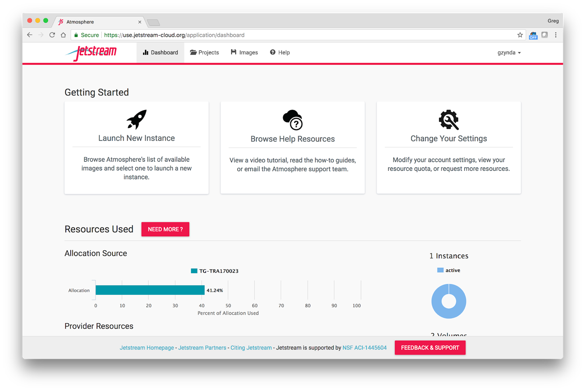

Click the project tab:

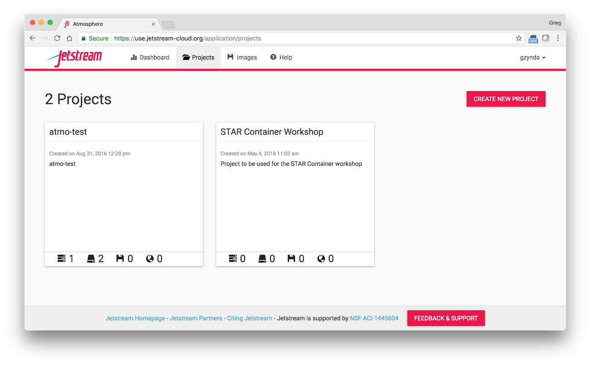

Select the “STAR Container Workshop” project (or create a new project called "STAR Container Workshop") and click “New” to launch a new instance for yourself. It will first ask you which image you want to start from. Today, we’ll be starting from “Ubuntu 16.04 Devel and Docker”. To find it you can just search “ubuntu docker” and it should be the first hit.

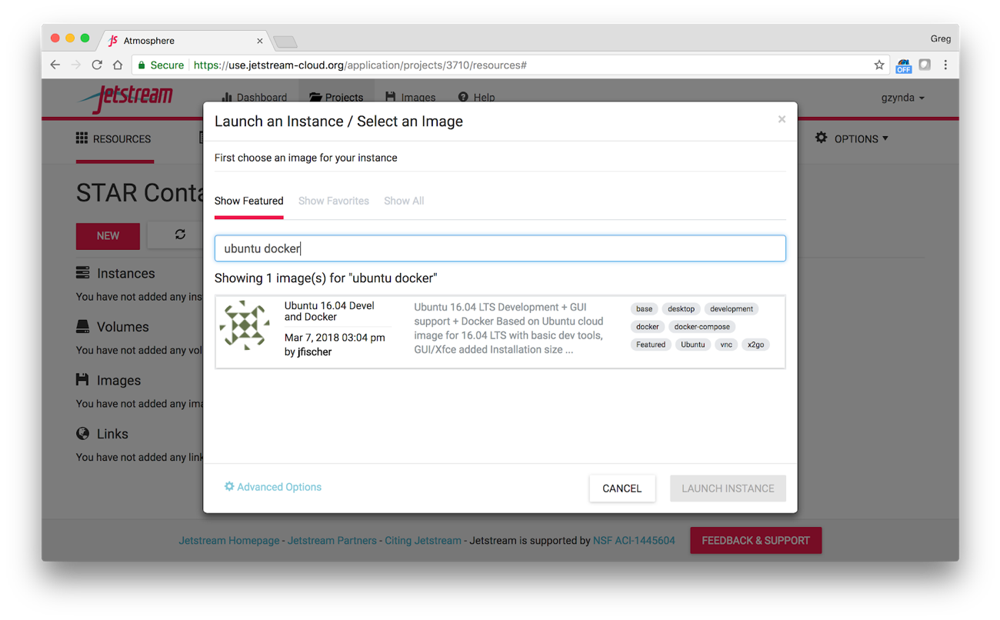

Then you need to specify the resources to allocate towards your instance. Choose an m1.small instance on the Jetstream - TACC provider.

***Please be sure to prefix your instance name with your username***

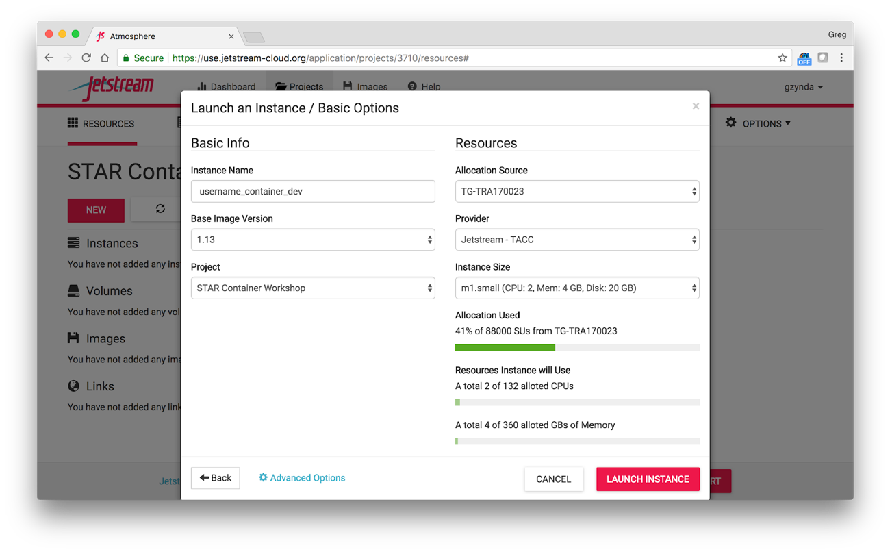

After clicking “Launch Instance” it will take about 10-15 minutes for your instance to deploy and be ready for use. You may also need to refresh the page.

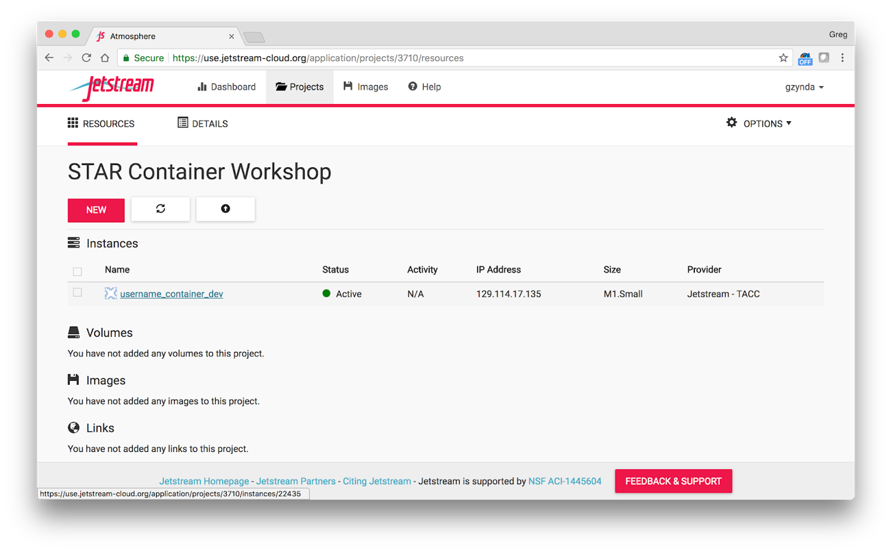

You can then select your instance and see all the options for managing it:

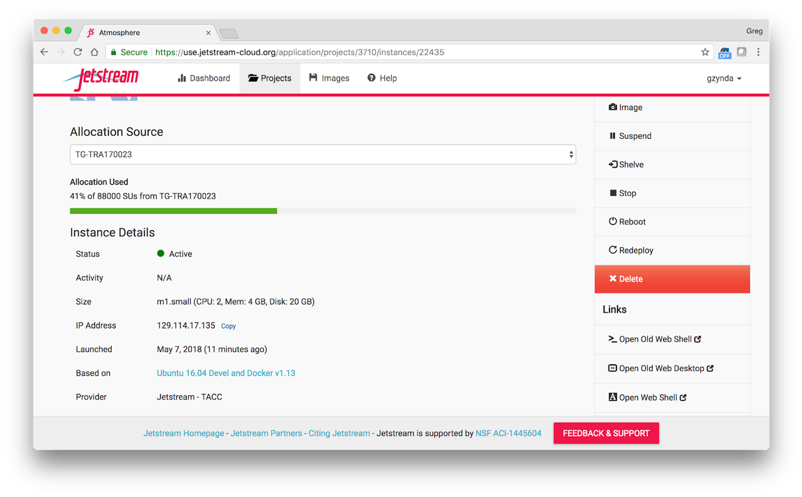

Please choose the “Open Web Shell” option, which will open a new tab to the CLI of your instance:

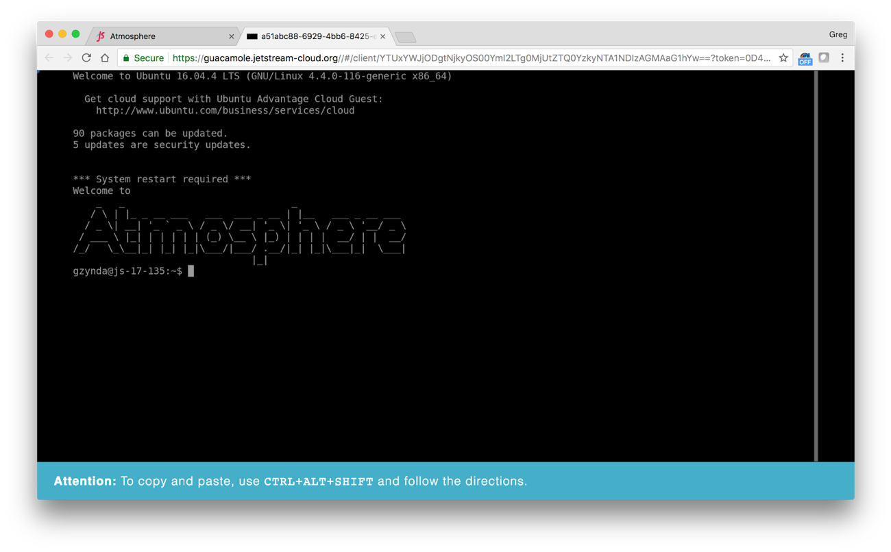

<br>
### Interacting with web shell

Pasting text is somewhat clunky, but output formatting is somewhat better in this than the old web shell. Please feel free to try either. If you do want to paste text, please press

`ctrl+alt+shift`


Paste your text in the text box, exit the side window by hitting

`ctrl+alt+shift`

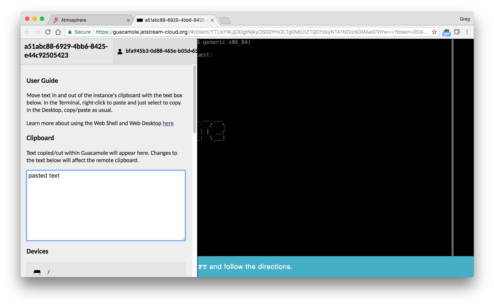

Again, right-click on the CLI to actually insert the text.

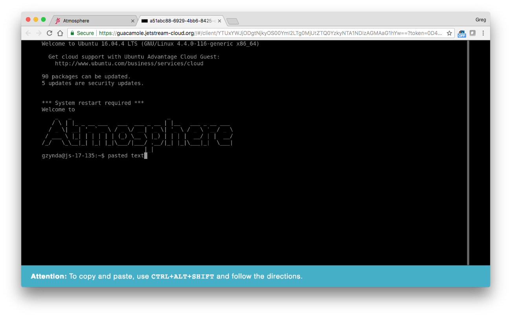

<br>
### Installing singularity

While we have pre-installed docker on your newly-launched image, you also need to install singularity. Stampede2 is still using Singularity 2.3.1, so we need to build the latest 2.3 release (2.3.2) from source.

```
VERSION=2.3.2
wget https://github.com/singularityware/singularity/releases/download/$VERSION/singularity-$VERSION.tar.gz
tar -xvf singularity-$VERSION.tar.gz
cd singularity-$VERSION
./configure --prefix=/usr/local
make
sudo make install
cd ..
rm -rf singularity*
singularity --version
```

Done! After the last command, you should see

```
2.3.2-dist
```

Because we are on a cloud system, and we are all using the same base image, this should just work. Welcome to the cloud, where EVERY development environment can be the same.

<br>
### Checking the installation

You can test the installation by pulling a Debian image from docker:

```
singularity pull --size 512 docker://debian:latest
singularity exec debian-latest.img cat /etc/*release
cat /etc/*release
```

<br>
### Singularity commands

Use `singularity help` on the command line to see a list of options:

```
$ singularity help
USAGE: singularity [global options...] <command> [command options...] ...

GLOBAL OPTIONS:
    -d --debug    Print debugging information
    -h --help     Display usage summary
    -s --silent   Only print errors
    -q --quiet    Suppress all normal output
       --version  Show application version
    -v --verbose  Increase verbosity +1
    -x --sh-debug Print shell wrapper debugging information

GENERAL COMMANDS:
    help          Show additional help for a command
    selftest      Run some self tests to make sure Singularity is
                    installed and operating properly

CONTAINER USAGE COMMANDS:
    exec          Execute a command within container
    run           Launch a runscript within container
    shell         Run a Bourne shell within container
    test          Execute any test code defined within container

CONTAINER USAGE OPTIONS:
    see singularity help <command>

CONTAINER MANAGEMENT COMMANDS:
    bootstrap     Bootstrap a new Singularity image from scratch [root]
    copy          Copy files from your host into the container
    create        Create a new container image
    expand        Grow the container image
    export        Export the contents of a container via a tar pipe
    inspect       Display a container's metadata
    import        Import/add container contents via a tar pipe
    mount         Mount a Singularity container image

CONTAINER REGISTRY COMMANDS:
    pull          pull a Singularity/Docker container to $PWD
```

<br>
# Pulling Containers

Try pulling a CentOS 7 container from DockerHub:

[https://hub.docker.com/r/library/centos/](https://hub.docker.com/r/library/centos/)


If you try a plain pull from docker using singularity 2.3, you will receive the following error:

```
$ singularity pull docker://centos:7
ERROR: Could not obtain the container size, try using --size
ABORT: Aborting with RETVAL=255
```

You can fix this with the `--size` parameter. You can see that the compressed image on DockerHub is fairly small, so lets try pre-allocating an image with 256 MB of space.

```
$ singularity pull --size 256 docker://centos:7
```

*NOTE: if you specify a size that is too small, and receive a stream of errors, you can cancel the process with `ctrl+c`.*

You can also name the image you pull to something useful:

```
$ singularity pull --size 256 --name c7.img docker://centos:7
```

When you run the pull command you will notice that singularity downloads several `*.tgz` files from DockerHub. These are cached by singularity in:

```
$ ls -lh ~/.singularity/docker
```

The default storage on a Jetstream instance is correlated with the number of requested cores unless you attach an external volume. To make sure you don’t run out of storage, you should either clean up your cache:

```
$ rm -rf ~/.singularity/docker/*
```

Or have singularity write to /tmp, which is cleaned up after every reboot:

```
SINGULARITY_TMPDIR=/tmp SINGULARITY_CACHEDIR=/tmp singularity --debug pull --size 256 --name ubuntu-tmpdir.img docker://ubuntu:latest
```

You can see the files it created by looking in `/tmp`

```
ls -lh /tmp/docker
```

<br>
### Exercise
Pull an image from DockerHub and include the date (year-month-day) in the filename.

[https://www.cyberciti.biz/faq/linux-unix-formatting-dates-for-display/](https://www.cyberciti.biz/faq/linux-unix-formatting-dates-for-display/)

You can print the current year with: `echo $(date +”%Y”)`

<br>
# Running Containers

Singularity containers can be invoked with `singularity command`, where `command` can be one of:
* `shell` - runs an interactive shell inside a container
* `exec` - runs a command inside a container
* `run` - launches the runscript of a container

The following examples will be using the miniconda image [available here](https://hub.docker.com/r/continuumio/miniconda/) Please pull it with:

```
$ singularity pull docker://continuumio/miniconda:4.4.10
```

<br>
### Running a container interactively (`shell`)

While not the best way to interact with containers in production or at scale, you can “enter” a container environment using the `singularity shell` command for invocation. If you have ever used ssh to reach another machine, this will be a similar experience.

```
$ singularity shell miniconda-4.4.10.img
```

Now that you are inside the container, is anything different? You should notice that your prompt text has changed, but what else? Are you a different user inside the container?

```
$ whoami
```

Did your current working directory change?

```
$ pwd
```

If you forgot where you were before, you can `exit` the container, check, and then re-enter the container. Do you see the same files?

```
$ ls
```

The goal of singularity is to ship an environment that can interact with the host devices and file systems without elevating user privileges. This means you will be the same user inside the container as you are on the outside. By default, your `$PWD`, `$HOME`, and `/tmp` directories are mounted inside the container. At TACC, your `$WORK` and `$SCRATCH` directories are also mounted inside containers. This is so the programs you build inside your container can interact with data on the outside.

Try writing files to different locations:

```
echo “hello” > world.txt
echo “hello” > /tmp/world.txt
echo “hello” > /root/world.txt
exit
```

That last command should not have worked because only the root user should have access to the `/root` folder. You can test this by entering the image using the sudo command:

```
sudo singularity shell miniconda-4.4.10.img
whoami
touch /root/cats
exit
```

This interaction is nice for prototyping a container, but it is not reproducible so we discourage it. If you have exited your root session of singularity, you can also see that those `world.txt` files do exist outside of the container you were running as well.

```
head world.txt /tmp/world.txt
```

Back inside the container, you can interactively run python code and write the results outside the container.

```
singularity shell miniconda-4.4.10.img
python --version &> container_python.txt
exit
cat container_python.txt
```

<br>
### Invoking a container with a command (`exec`)
The `exec` command is much like the `docker run` command, where it takes arguments and runs time in a shell in the container and then exits.

```
python --version
singularity exec miniconda-4.4.10.img python --version
```

This is the way we recommend working with a singularity container on TACC systems. You can create a single environment and then run external scripts

<br>
### Default invocation (`run`)
Similar to the `CMD` rule for docker containers, a singularity container contains a `%runscript%` section, which is run whenever a container is launched with `run`.

This is explained in the next section.

<br>
# Building Containers


[PySIT](http://pysit.org/) is an open source toolbox for seismic inversion and seismic imaging developed by Russell J. Hewett and Laurent Demanet in the Imaging and Computing Group in the Department of Mathematics at MIT.

Here, we will demonstrate how to build a singularity image of the PySIT toolbox, then run the “horizontal reflector” demo described here:

[http://pysit.readthedocs.io/en/latest/examples/horizontal_reflector.html](http://pysit.readthedocs.io/en/latest/examples/horizontal_reflector.html)

<br>
### Singularity bootstrap
Besides pulling pre-built docker images, you can build your own by writing a definition file and bootstrapping (building) the image on your own.

A singularity file contains a header, which specifies the manager and base OS to build from.

<br>
### Docker header
```
Bootstrap: docker
From: ubuntu:latest
```

<br>
### CentOS header
```
BootStrap: yum
OSVersion: 7
MirrorURL: http://mirror.centos.org/centos-%{OSVERSION}/%{OSVERSION}/os/$basearch/
Include: yum
```

<br>
### Definition sections
After you make your header, you just need to write the sections of your container.

* `%setup` - When you need to run commands and copy files into the container before `%post`
* `%post` - The actual setup commands
  * Making directories
  * yum/apt commands
  * git clone
  * make
* `%labels` - Any metadata you want associated with your container
  * NAME VALUE
* `%environment` - Environment values that are sources whenever using the container
  * NAME VALUE
* `%runscript` - This is what runs when you singularity run the container
  * Prefix the execution command with exec
* `%test` - A test to make sure the container was built correctly
  * Runs after `%post`
  * Run anytime using singularity test

<br>
### Definition file for PySIT

Pull an example PySIT definition file with the following command:

```
$ wget https://raw.githubusercontent.com/wjallen/SingularityWorkshop/master/examples/pysit.def
```

Or, better yet, type it out manually:

```
################################################## pysit.def
Bootstrap: docker
From: debian:latest

%setup

%post

  apt-get update --fix-missing && apt-get install -y wget bzip2 ca-certificates \
    build-essential gfortran \
    libglib2.0-0 libxext6 libsm6 libxrender1 \
    git mercurial subversion

  wget --quiet https://repo.continuum.io/archive/Anaconda2-5.1.0-Linux-x86_64.sh -O ~/anaconda.sh && \
    /bin/bash ~/anaconda.sh -b -p /opt/conda && \
    rm ~/anaconda.sh && \
    ln -s /opt/conda/etc/profile.d/conda.sh /etc/profile.d/conda.sh && \
    echo ". /opt/conda/etc/profile.d/conda.sh" >> ~/.bashrc && \
    echo "conda activate base" >> ~/.bashrc

  /opt/conda/bin/pip install obspy==0.9.0 pyamg pysit

%labels

%environment

  LANG=C.UTF-8
  LC_ALL=C.UTF-8
  SINGULARITYENV_PREPEND_PATH=/opt/conda/bin

%runscript

%test

  PYSIT=$(/opt/conda/bin/conda list pysit | grep pysit)
  echo $PYSIT

##################################################
```

This is an abridged, simpler version of the above definition file that has anaconda pre-installed:

```
################################################## pysit-2.def
Bootstrap: docker
From: continuumio/anaconda:latest

%setup

%post

  apt-get update && apt-get install -y build-essential gfortran
  /opt/conda/bin/pip install obspy==0.9.0 pyamg pysit

%labels

%environment

%runscript

%test

  PYSIT=$(/opt/conda/bin/conda list pysit | grep pysit)
  echo $PYSIT

##################################################
```

<br>
### Bootstrapping

After creating your image, you can bootstrap the image as follows:

```
singularity create -F -s 8192 pysit-0.5b3.img
sudo singularity bootstrap pysit-0.5b3.img pysit.def
- or -
singularity create -F -s 8192 pysit-0.5b3-2.img
sudo singularity bootstrap pysit-0.5b3-2.img pysit-2.def
```

Next, download a test script with the following command:

```
$ wget https://raw.githubusercontent.com/wjallen/SingularityWorkshop/master/examples/horizontal_reflector.py
```

This python script will generate random seismic data, execute an inversion algorithm, then plot the results in an output figure. Trying to run the script locally will fail, as the PySIT libraries are not found:

```
$ python horizontal_reflector.py
...
ImportError: No module named pysit
```

Run the python script inside the container as follows:

```
$ singularity exec pysit-0.5b3.img /opt/conda/bin/python horizontal_reflector.py
```

If all goes well, you should find an ‘output.png’ file in the current directory. View it in the Jetstream web desktop UI.

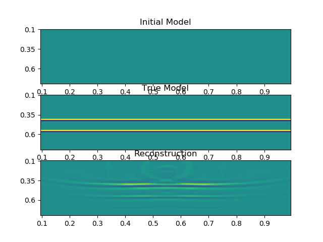


<br>
# Singularity on HPC

Up to now, we have run singularity on our cloud system, Jetstream. This is analogous to how singularity could be run on our personal computers or small servers. In the next section we will demonstrate how to run singularity on the Stampede2 supercomputer using the batch queueing system. This enables large-scale, parallel jobs employing MPI.

First, log into the TACC Vis Portal using your XSEDE credentials: [https://vis.tacc.utexas.edu/](https://vis.tacc.utexas.edu/)

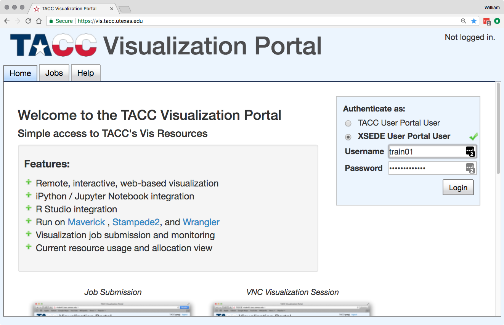

Click on the ‘Stampede2’ tab, scroll down, and click ‘Set VNC Password’. This should NOT be your TACC / XSEDE password, this can be something benign like ‘12345’.

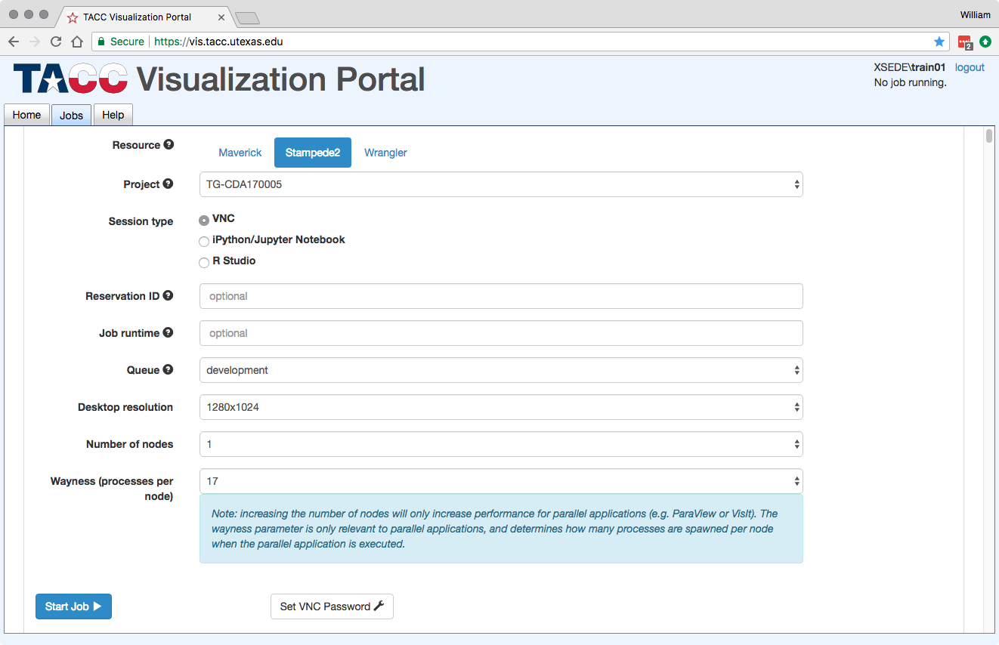

Click on the Stampede2 tab again, and click ‘Start Job’. A job will be submitted to the Stampede2 queue on your behalf. Watch the progress message until it starts running:

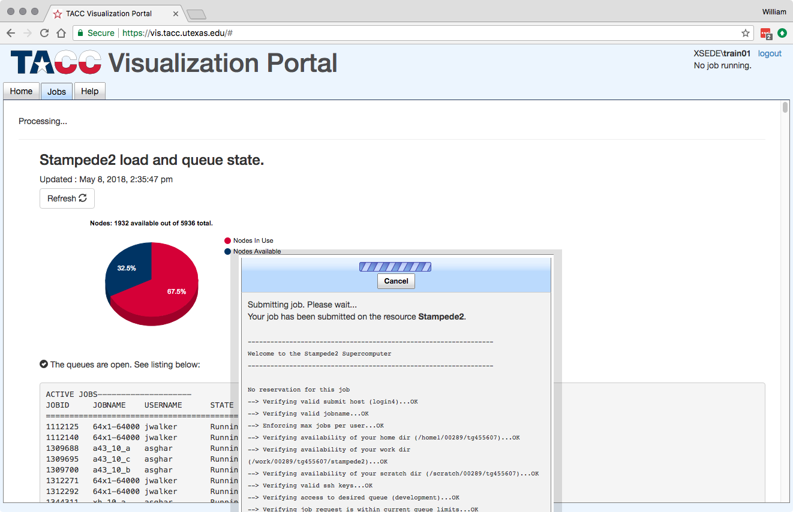

When the job begins, a new tab will be available on the top of the page. Click the ‘Desktop’ tab, enter your VNC password (e.g. ‘12345’), and press Return.

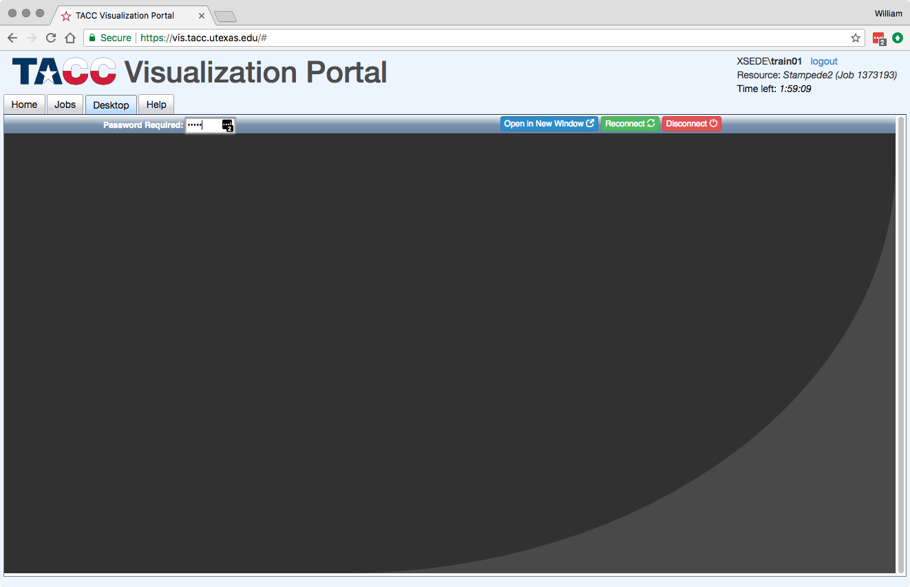

Then, you will be taken to a virtual desktop on a Stampede2 compute node, complete with a GUI and terminal interface.

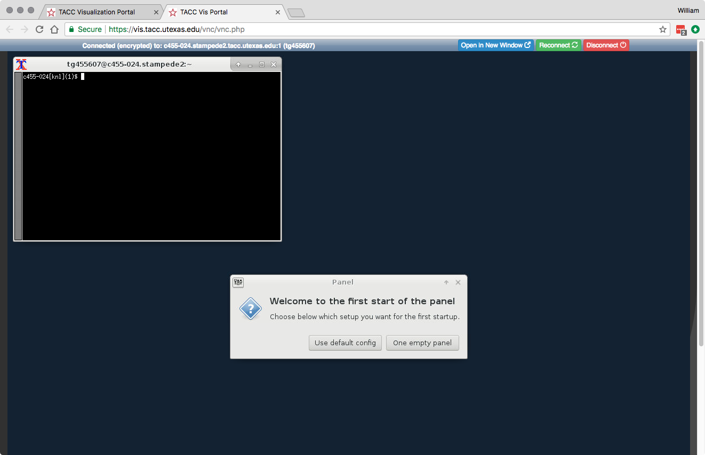


Most jobs on an HPC cluster are neither interactive, nor realtime. When you submit a job to the scheduler, you must tell it what resources you need (e.g. how many nodes, what type of nodes) and what you want to run. Then the scheduler finds resources matching your requirements, and runs the job for you when it can.

For example, if you want to run the command:

```
$ singularity exec pysit-0.5b3.img /opt/conda/bin/python horizontal_reflector.py
```

On an HPC system, your job submission script would look something like:

```
#!/bin/bash
#
#SBATCH -J myjob                      # Job name
#SBATCH -o output.%j                  # Name of stdout output file (%j expands to jobId)
#SBATCH -p development                # Queue name
#SBATCH -N 1                          # Total number of nodes requested (68 cores/node)
#SBATCH -n 17                         # Total number of mpi tasks requested
#SBATCH -t 02:00:00                   # Run time (hh:mm:ss) - 4 hours

module load tacc-singularity
IMGLOC=/work/03439/wallen/public
singularity exec $IMGLOC/pysit-0.5b3.img /opt/conda/bin/python horizontal_reflector.py
```

This example is for the Slurm scheduler, a popular one used by all TACC systems. Each of the `#SBATCH` lines looks like a comment to the bash kernel, but the scheduler reads all those lines to know what resources to reserve for you.

Because we logged in via the Vis Portal, we are automatically in an interactive session on a compute node. However, batch jobs must be submitted from login nodes. So, first ssh over to a compute node and submit the batch job from there:

```
$ ssh login1
$ sbatch batch.slurm
```

Note: Every HPC cluster is a little different, but they almost universally have a “User’s Guide” that serves both as a quick reference for helpful commands and contains guidelines for how to be a “good citizen” while using the system. For TACC’s Stampede2 system, the user guide is at: [https://portal.tacc.utexas.edu/user-guides/stampede2](https://portal.tacc.utexas.edu/user-guides/stampede2)

A few things to consider when using HPC systems:

* Using ‘sudo’ is not allowed on HPC systems, and building a Singularity container from scratch requires sudo. That means you have to build your containers on a different development system. You can pull a docker image on HPC systems
* If you need to edit text files, command line text editors don’t support using a mouse, so working efficiently has a learning curve. There are text editors that support editing files over SSH. This lets you use a local text editor and just save the changes to the HPC system.
* Singularity is in the process of changing image formats. Depending on the version of Singularity running on the HPC system, new squashFS or .simg formats may not work.


<br>
# Advanced Singularity

In this section, we cover some of the advanced capabilities of singularity.
##Singularity and MPI
Singularity was designed to support HPC applications, so it naturally supports MPI and communication over the host fabric. Which usually just works because the network is the same inside and outside the container. The more complicated bit is making sure that the container has the right set of MPI libraries. MPI is an open specification, but there are several implementations (OpenMPI, MVAPICH2, and Intel MPI to name three) with some non-overlapping feature sets. If the host and container are running different MPI implementations, or even different versions of the same implementation, hilarity may ensue.

The general rule is that you want the version of MPI inside the container to be the same version or newer than the host. You may be thinking that this is not good for the portability of your container, and you are right. Containerizing MPI applications is not terribly difficult with Singularity, but it comes at the cost of additional requirements for the host system.

| Note |
|:--|
| Many HPC Systems, like Stampede2, have highspeed, low latency networks that have special drivers. Infiniband, Ares, and OmniPath are three different specs for these types of networks. When running MPI jobs, if the container doesn’t have the right libraries, it won’t be able to use those special interconnects to communicate between nodes. |


The Stampede 2’s Intel MPI implementation is ABI compatible with MPICH, which *can* be `apt-get` installed from normal Ubuntu repositories. Lonestar 5’s cray_mpich is a separate [can of worms](https://github.com/singularityware/singularity/issues/876), so we recommend using Stampede2 for singularity+mpi.

### Hello World


While not the most exciting, it is mandatory that we compile and run a singularity-based hello world MPI image. This means we’ll be writing another definition file.

To improve usability and hopefully reduce confusion, I took the liberty of creating a docker file with a version of MPI that is compatible with Stampede 2 that we can bootstrap from.

https://hub.docker.com/r/gzynda/tacc-stampede2-mpi/

Please create `hello_mpi.dsc` with the following contents

```
Bootstrap: docker
From: gzynda/tacc-stampede2-mpi:latest

%setup


# Pre-build commands

# Copy files necessary in POST ( <= v2.3 )
cp mpi_hello_world.c $SINGULARITY_ROOTFS/mpi_hello_world.c

%files

# Include any necessary files from host

%post


# Installation commands

# Compile program
mpicc mpi_hello_world.c -o /usr/local/bin/mpi_hello_world

%labels


# Include any metadata 
Version 0.1

%environment


# Modify the environment

%runscript


# used with singularity run
echo "Running hello world"
exec mpi_hello_world

%test


# quality control tests
mpirun -n 2 mpi_hello_world
```

Then you can build the image by running

```
wget https://raw.githubusercontent.com/wesleykendall/mpitutorial/gh-pages/tutorials/mpi-hello-world/code/mpi_hello_world.c
sudo singularity create --size 512 hello_mpi.img
sudo singularity bootstrap hello_mpi.img hello_mpi.dsc
```

Assuming you have MFA set up, you can transfer your `hello_mpi.img` image to Stampede 2 and run it in a multi-node idev session.

```
# Transfer the image
scp hello_mpi.img stampede2.tacc.utexas.edu:

# Log into stampede
ssh stampede2.tacc.utexas.edu
```

Then continuing on Stampede 2

```
# Launch an 2-node idev session
idev -N 2 -n 8

# Load singularity module
module load tacc-singularity

# Run container
ibrun singularity run hello_mpi.img
```

This will hopefully get you started building your own MPI-enabled containers.

<br>
## Singularity and MPI

<br>
## Singularity and GPU computing

We will not cover GPU computing in this workshop, as Jetstream and Stampede2 do not have GPUs. However, know that GPUs are supported in singularity. Since singularity supported docker containers, it has been fairly simple to utilize GPUs for machine learning code like TensorFlow. For example, singularity commands on a machine with GPUs available may appear as:

```
$ singularity pull docker://nvidia/caffe:latest
$ singularity exec --nv caffe-latest.img caffe device_query -gpu 0
```

Please note that the –nv flag specifically passes the GPU drivers into the container. If you leave it out, the GPU will not be detected.

```
$ singularity exec caffe-latest.img caffe device_query -gpu 0
ERROR: GPU not detected
```

If you are interested in utilizing GPUs at TACC, please request time on Maverick, and check our [GPGPU comupting guide with singuarlity](https://cyverse-container-camp-workshop-2018.readthedocs-hosted.com/en/latest/singularity/singularityadvanced.html#singularity-and-gpu-computing)

<br>
# Bring Your Own Code

Do you have some software that you would like to containerize? Let’s use any remaining time to work together on it.

<br>
# Additional Resources

<br>
### Singularity Related Resources

[Singularity Homepage](http://singularity.lbl.gov/)

[Singularity Hub](https://www.singularity-hub.org/)

[University of Arizona Singularity Tutorials](https://docs.hpc.arizona.edu/display/UAHPC/Singularity+Tutorials)

[NIH HPC](https://hpc.nih.gov/apps/singularity.html)

[Dolmades - Windows Apps in Linux Docker-Singularity Containers](http://dolmades.org) *Warning not tested*

<br>
### Singularity Talks

Gregory Kurtzer, creator of Singularity has provided two good talks online:

[Introduction to Singularity](https://wilsonweb.fnal.gov/slides/hpc-containers-singularity-introductory.pdf)

[Advanced Singularity](https://www.intel.com/content/dam/www/public/us/en/documents/presentation/hpc-containers-singularity-advanced.pdf>)

Vanessa Sochat, lead developer of Singularity Hub, also has given a great talk on:

[Singularity](https://docs.google.com/presentation/d/14-iKKUpGJC_1qpVFVUyUaitc8xFSw9Rp3v_UE9IGgjM/pub?start=false&loop=false&delayms=3000&slide=id.g1c1cec989b_0_154>)
